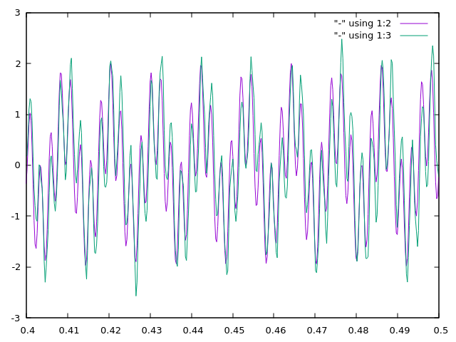
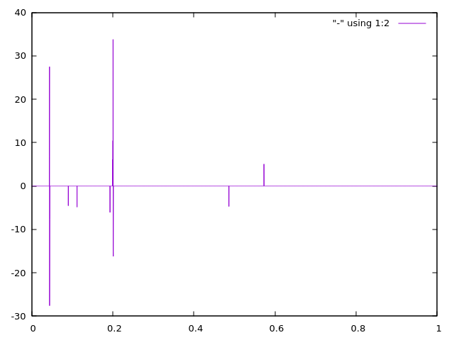

# CoSaMP

CoSaMP algorithm in Haskell. 

[Documentation](https://augustunderground.github.io/cosamp)

## Use in Stack Project

Add this to `stack.yaml`:

```yaml
extra-deps:
 - github: augustunderground/cosamp
   commit: <current-commit>
```

## Example

```haskell
import CoSaMP
import Numeric.LinearAlgebra
import Graphics.Plot

main :: IO ()
main      = mplot [t, s] >> mplot [tWin, xWin, xWin']
  where 
    n     = 4096 :: Int
    t     = linspace n (0.0, 1.0 :: Double)
    x     = sin ( 91 * 2 * pi * t ) + sin ( 412 * 2 * pi * t )
    p     = 128 :: Int
    aquis = cmap floor 
          $ scale (realToFrac n - 1) (randomVector 666 Uniform p) :: Vector I
    y     = flatten $ asRow x ?? (All, Pos aquis)
    φ     = dctOrtho (ident n :: Matrix Double)
    cφ    = φ ?? (Pos aquis, All)
    s     = cosamp cφ y 10 100 1.0e-10
    x'    = idctOrtho s
    wIdx  = idxs $ find (\i -> i >= 0.4 && i <= 0.5) t
    tWin  = flatten $ asRow t ?? (All, Pos wIdx)
    xWin  = flatten $ asRow x ?? (All, Pos wIdx)
    xWin' = flatten $ asRow x' ?? (All, Pos wIdx)
```





## Build From Source

```
$ git clone https://github.com/augustunderground/cosamp
$ cd cosamp
$ stack build
$ stack install
$ stack run
```

# References and Resources

This is a Haskell implementation of the Compressive Sampling Matched Pursuit
(CoSaMP) algorithm as presented in Needell and Tropp's 2008
[paper](http://arxiv.org/abs/0803.2392).

There are also reference implementations available in:
- [MATLAB](https://www.mathworks.com/matlabcentral/fileexchange/32402-cosamp-and-omp-for-sparse-recovery).
- [Python](https://github.com/rfmiotto/CoSaMP) which is based on 
